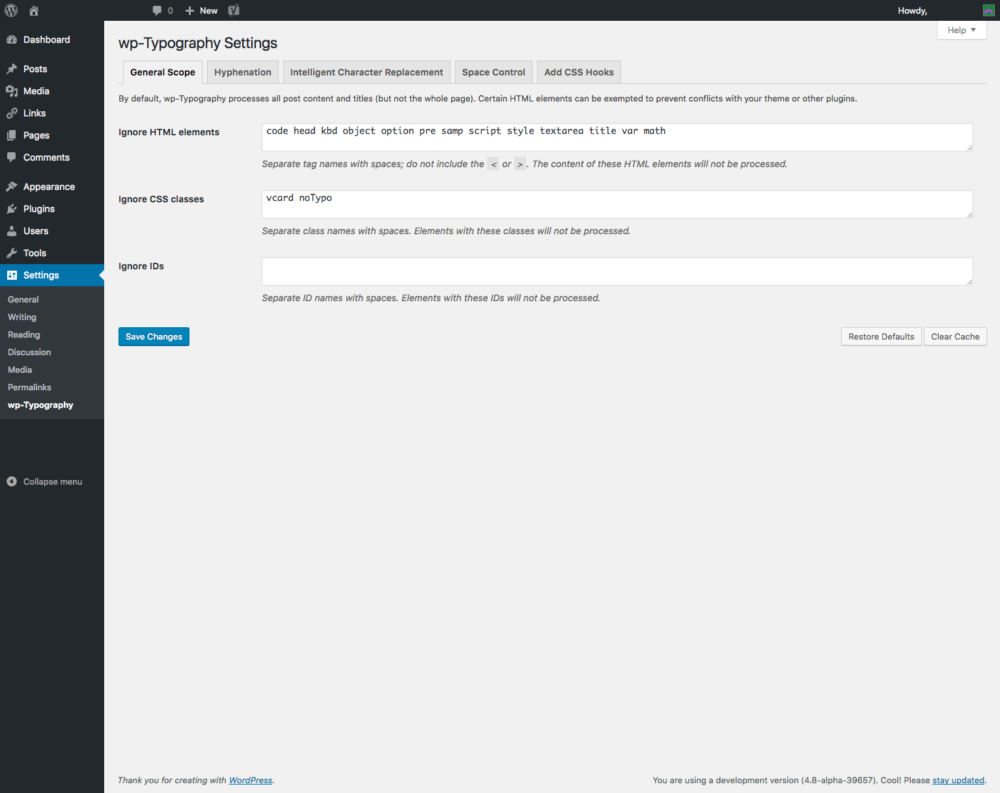
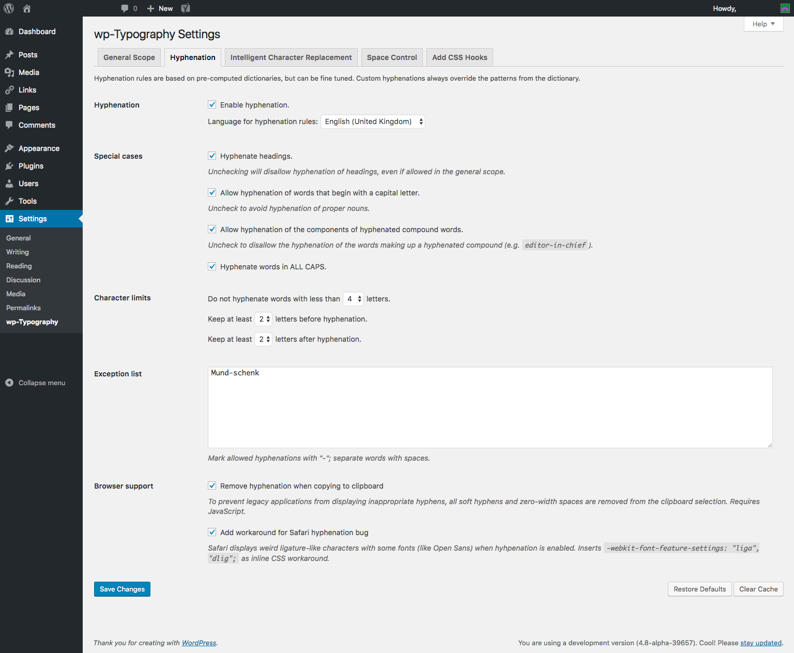
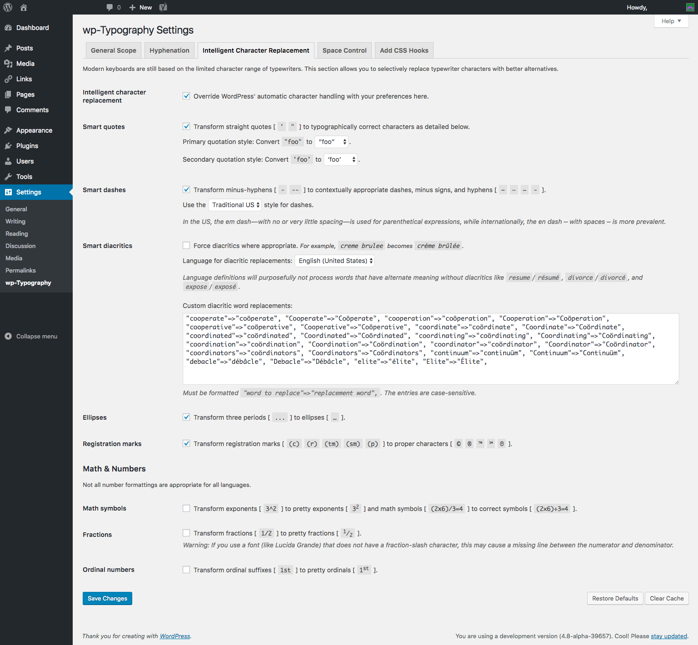
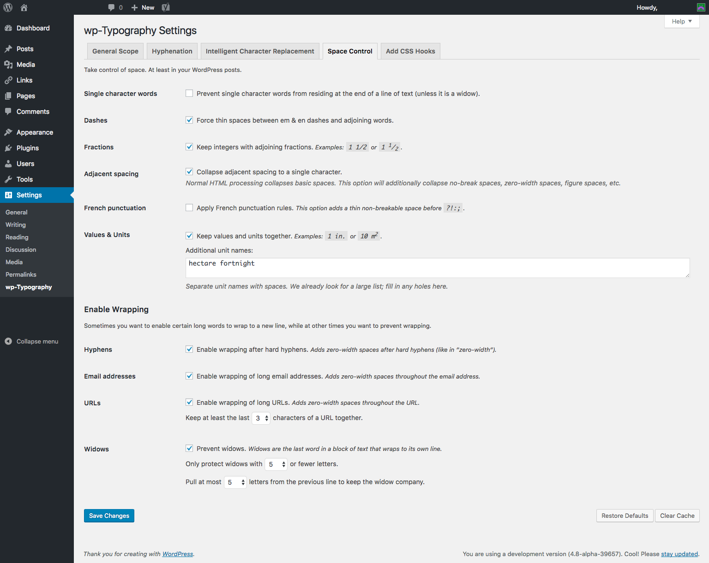

# wp-Typography #

Improve your web typography with:

* Hyphenation &mdash; [over 50 languages supported](https://code.mundschenk.at/wp-typography/frequently-asked-questions/#what-hyphenation-language-patterns-are-included)

* Space control, including:
    * widow protection
    * gluing values to units
    * forced internal wrapping of long URLs & email addresses

* Intelligent character replacement, including smart handling of:
    * quote marks
    * dashes
    * ellipses
    * trademarks, copyright & service marks
    * math symbols
    * fractions
    * ordinal suffixes

* CSS hooks for styling:
    * ampersands,
    * uppercase words,
    * numbers,
    * initial quotes & guillemets.

wp‐Typography has the following requirements:

* the host server must run PHP 5.3.4 or later
* your installation of PHP 5.3.4+ must include the [mbstring extension](http://us3.php.net/manual/en/mbstring.installation.php) (most do)
* text must be encoded UTF‐8

wp-Typography can easily be ported to any other PHP based content management system. The subdirectory `php-typography` assembles all typographic functionality (without any WordPress specific code) in an object oriented format that is ready for WordPress independent use.

View the [wp-Typography homepage](https://code.mundschenk.at/wp-typography/ "wp-Typography Homepage") for more information.

## Installation ##

1. Log in to WordPress as an administrator
2. Go to `Plugins > Add New` and search for `wp-Typography`
3. Click `install` next to the wp-Typography plugin description
4. Click the `Install Now` button in the pop-up window
5. After the plugin is installed, click the `Activate Plugin` link
6. Go to `Settings > wp-Typography` to set your preferences

Alternately, you may manually upload the plugin by following the following instructions:

1. Go to [http://wordpress.org/extend/plugins/wp-typography/](http://wordpress.org/extend/plugins/wp-typography/), and click the `Download` button
2. Unzip the `wp-Typography.x.x.zip` file
3. Using your favored FTP client, upload the `wp-typography` folder to the `/wp-content/plugins/` directory
4. Log in to WordPress as an administrator
5. Go to `Plugins > Installed`, locate the plugin and click the related `Activate` link.
6. Go to `Settings > wp-Typography` to set your preferences

## Frequently Asked Questions ##

FAQs are maintained at the [wp-Typography website](https://code.mundschenk.at/wp-typography/frequently-asked-questions/ "wp-Typography FAQs").

Three questions come up so frequently, we will republish their answers here:

### Will this plu­gin slow my page load­ing times? ###

Yes. Use [WP Super Cache](http://wordpress.org/extend/plugins/wp-super-cache/).

### This plugin breaks post title links.  What gives? ###

More likely than not, your WordPress theme is using an improper function to set the title attribute of your heading's link.  It is probably using the `the_title()` function, which delivers the post title *after* filtering.  It should be using `the_title_attribute()` which delivers the post title *before* filtering.  Change out this function throughout your theme when it is used inside of an HTML tag, and the problem should go away.

If you are uncomfortable editing your theme's code, you may alternatively go to the wp-Typography settings page in your admin panel and add `h1` and `h2` to the "Do not process the content of these HTML elements:" field.  This will disable typographic processing within improperly designed page title links <em>and</em> page titles.

### Does this plugin work with wp-Typogrify? ###

This plugin is an official replacement for the [wp-Typogrify plugin](http://wordpress.org/extend/plugins/wp-typogrify/).  Please uninstall wp-Typogrify and install wp-Typography in its place.

Remember, many more FAQs are are addressed the [wp-Typography website](https://code.mundschenk.at/wp-typography/frequently-asked-questions/).

## Screenshots ##

### wp-Typography Administrative Settings ###

## Changelog ##

A detailed release changelog can be found on the [wp-Typography website](https://code.mundschenk.at/wp-typography/changes/).
